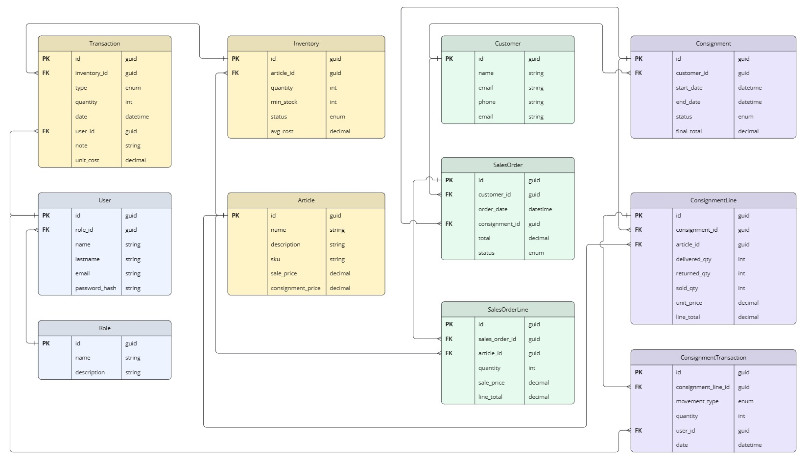

# Kioskito API

API para gestión de kiosco / consignaciones construida con .NET 8 (Clean Architecture + CQRS + MediatR + EF Core + JWT).

## Estructura de la solución
```
root
 ?? src
 ?   ?? API                -> Capa de presentación (endpoints REST, Swagger, autenticación JWT)
 ?   ?? Application        -> Lógica de aplicación (CQRS: Commands/Queries, Validations, Interfaces)
 ?   ?? Domain             -> Entidades, enums, interfaces de dominio base
 ?   ?? Infrastructure     -> EF Core, Repositories, Migrations, JWT, Implementaciones
 ?? deploy                 -> Orquestación Docker (compose + env)
 ?? test
     ?? Application.Tests  -> Pruebas unitarias de la capa Application
```

### Capas
- `Domain`: Entidades puras y contratos (no depende de otras capas).
- `Application`: Usa MediatR para commands/queries. Define `IUnitOfWork`, validadores (FluentValidation) y excepciones.
- `Infrastructure`: Persistencia (EF Core + PostgreSQL), repositorios, UoW, autenticación JWT.
- `API`: Endpoints REST, Swagger, filtros, middlewares.

## Principales patrones / librerías
- CQRS + MediatR
- Repositorio genérico + específicos
- Unit of Work
- FluentValidation
- JWT Authentication (Bearer)
- EF Core (convención snake_case en base de datos)

## Entidades principales
- Users / Roles (autenticación y autorización)
- Articles (catálogo de productos)
- Inventory / Transaction (stock y movimientos)
- Customer
- Consignment / ConsignmentLine / ConsignmetTransaction
- SalesOrder / SalesOrderLine

## Modelo de datos

*(Asegúrate de colocar la imagen en `docs/images/data-model.png`)*

## Variables de entorno (appsettings.json)
Ejemplo sección JWT + cadena de conexión:
```json
{
  "JwtSettings": {
    "SecretKey": "CAMBIAR_ESTA_CLAVE_SUPER_SECRETA",
    "Issuer": "kioskito-api",
    "Audience": "kioskito-clients",
    "ExpiresInMinutes": 60
  },
  "ConnectionStrings": {
    "Default": "Host=postgres;Port=5432;Database=kioskito;Username=postgres;Password=postgres;"
  }
}
```
> Nota: en variables de entorno usar `ConnectionStrings__Default`.

## Ejecución con Docker Compose (carpeta `deploy/`)
Estructura:
```
deploy/
  docker-compose.yml
  env/
    api.env
```
Archivo `deploy/env/api.env` ejemplo:
```
ConnectionStrings__Default=Host=db;Port=5432;Database=kioskitoDb;Username=admin;Password=gonzalito
JwtSettings__SecretKey=CAMBIAR_ESTA_CLAVE_SUPER_SECRETA
JwtSettings__Issuer=kioskito-api
JwtSettings__Audience=kioskito-clients
JwtSettings__ExpiresInMinutes=60
ASPNETCORE_ENVIRONMENT=Development
```
### Levantar servicios
```bash
docker compose -f deploy/docker-compose.yml up --build
# o en segundo plano
docker compose -f deploy/docker-compose.yml up -d --build
```
Detener:
```bash
docker compose -f deploy/docker-compose.yml down
```
Eliminar volúmenes (datos DB):
```bash
docker compose -f deploy/docker-compose.yml down -v
```
La API quedará disponible en: http://localhost:8080/swagger

## Migraciones EF Core
Crear migración:
```bash
dotnet ef migrations add NombreMigracion -p src/Infrastructure/Infrastructure.csproj -s src/API/API.csproj
```
Aplicar migraciones:
```bash
dotnet ef database update -p src/Infrastructure/Infrastructure.csproj -s src/API/API.csproj
```

## Autenticación / Flujo
1. Registrar usuario: `POST api/auth/sign-up` ? devuelve JWT.
2. Login: `POST api/auth/login` ? devuelve JWT.
3. Usar: `Authorization: Bearer <token>` en endpoints protegidos.

## Endpoints (ejemplos)
- POST `api/auth/sign-up`
- POST `api/auth/login`
- POST `api/articles`
- GET  `api/articles`
- GET  `api/articles/{id}`
- PUT  `api/articles/{id}`
- DELETE `api/articles/{id}`
- CRUD `api/customers`

## Tests
```bash
dotnet test
```

## Mejores prácticas pendientes / backlog
- Soft delete global (`HasQueryFilter`)
- Auditoría (CreatedBy / UpdatedAt / UpdatedBy)
- Eventos de dominio ? integración (RabbitMQ / Outbox)
- Cache distribuida (Redis) para catálogos
- Observabilidad (HealthChecks, Metrics, Logging estructurado)

## Notas
- Ajusta claves y cadenas antes de producción.
- Nunca uses la `SecretKey` de ejemplo en entornos reales.
- Revisa `.dockerignore` para optimizar el contexto de build.

---
© Kioskito API
